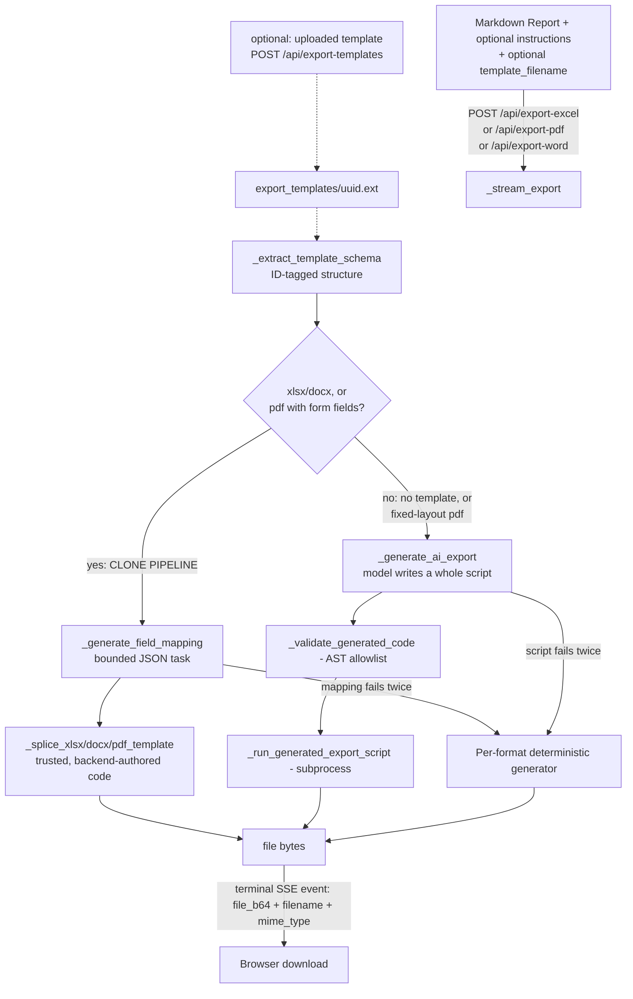

# Document File Exporting Skill

This skill documents the document export system that turns an AI-generated Markdown
analysis report into a polished Excel (`.xlsx`), PDF (`.pdf`), or Word (`.docx`) file.
There are **two distinct pipelines**, chosen automatically based on whether a template
was uploaded:

1. **No template (or a fixed-layout PDF template)**: the model writes a whole Python
   script from scratch that builds the document, validated and run in a sandboxed
   subprocess. The model decides the entire structure - sheet/page count, which
   sections are tables vs prose, formatting. See section 4.
2. **Template uploaded (xlsx, docx, or a PDF with real form fields)**: the **clone
   pipeline**. The model's only job is a bounded field-mapping task (given the
   template's real structure, return JSON `{location_id: value}`) - it never writes
   or runs any code. A trusted, backend-authored splice function applies that mapping
   directly to the template file. See section 6 - **this is the important one**, it's
   what makes template exports actually preserve the template.

The panel-3 "Export PDF/Excel/Word" buttons and the "Export Instructions" modal are
**merged, not separate UIs**: clicking a panel-3 button opens the modal landed on that
button's format tab (`openExportModal(fmt)` in `static/script.js`) instead of firing an
export directly. There is no standalone header button for this anymore. Inside the
modal, leaving instructions empty and no template attached and clicking "Export as
<format>" reproduces the exact old one-click behavior (pipeline 1, no instructions) -
the merge only changed how you reach the export action, not what it does by default.
Both pipelines share this modal UI, the SSE progress-streaming endpoint shape, and the
deterministic per-format fallback used when either pipeline fails.

---

## Architecture Overview

---

## 1. File Locations

| Component | File | Function/Element |
|-----------|------|-----------------|
| Backend endpoints (all three) | `app.py` | `export_excel()` / `export_pdf()` / `export_word()` at `/api/export-{excel,pdf,word}` |
| Shared SSE pipeline + pipeline dispatch | `app.py` | `_stream_export()` |
| Template structure extraction | `app.py` | `_extract_template_schema()` |
| **Clone pipeline** (template exports) | `app.py` | `_run_template_clone_pipeline()`, `_generate_field_mapping()`, `_extract_json_object()` |
| **Clone pipeline splice functions** (trusted, not model-generated) | `app.py` | `_splice_xlsx_template()`, `_splice_docx_template()`, `_splice_pdf_form_template()` |
| **Script pipeline** (no template, or fixed-layout PDF) | `app.py` | `_generate_ai_export()` |
| Per-format config (skill prompt, allowed imports, etc.) | `app.py` | `ExportFormat` + `_excel_format()` / `_pdf_format()` / `_word_format()` |
| Skill prompts for the script pipeline | `app.py` | `_EXCEL_SKILL_SYSTEM_PROMPT` / `_PDF_SKILL_SYSTEM_PROMPT` / `_WORD_SKILL_SYSTEM_PROMPT` |
| Field-mapping prompt for the clone pipeline | `app.py` | `_FIELD_MAPPING_SYSTEM_PROMPT` |
| Code-block extraction (script pipeline only) | `app.py` | `_extract_code_block()` |
| Safety validation (AST allowlist, script pipeline only) | `app.py` | `_validate_generated_code()` |
| Isolated script execution | `app.py` | `_run_generated_export_script()` |
| Shared markdown block parser | `app.py` | `_parse_markdown_blocks()` |
| Shared value-type detection | `app.py` | `smart_value()` (used by the Excel fallback AND `_splice_xlsx_template`) |
| Deterministic Excel/PDF/Word fallback | `app.py` | `_generate_excel_bytes()` / `_generate_pdf_bytes()` / `_generate_word_bytes()` |
| Frontend (shared SSE consumer for all 3) | `static/script.js` | `runSkillExport()`, called only from `runExportFromModal()` |
| Export progress bar markup | `static/index.html` | `#export-progress-container` / `#export-progress-fill` / `#export-progress-label` |
| Panel-3 export buttons (open the modal on that format's tab) | `static/index.html` / `static/script.js` | `#export-excel-btn` / `#export-pdf-btn` / `#export-word-btn` → `exportToExcel()`/`exportToPDF()`/`exportToWord()` → `openExportModal(fmt)` |
| Export Instructions modal (3 sub-tabs, no separate entry button) | `static/index.html` | `#export-instructions-overlay`, `.export-tab-panel[data-format=...]` |
| Modal state + wiring | `static/script.js` | `exportState`, `openExportModal(fmt)`, `switchExportTab()`, `runExportFromModal()` |
| Template upload endpoint | `app.py` | `POST /api/export-templates` → `upload_export_template()` |
| Export-instructions presets endpoints | `app.py` | `GET/POST/DELETE /api/export-presets[/{name}]` |
| Export-instructions AI Enhance | `app.py` | `POST /api/enhance-instructions` |
| Template path safety | `app.py` | `_template_path()`, `_is_template_filename_valid()`, `_delete_template_if_orphaned()` |

---

## 2. How a request flows

1. The browser `POST`s `{markdown, instructions, template_filename}` to
   `/api/export-excel` (or pdf/word) and reads the response as a Server-Sent Events
   stream. `instructions` and `template_filename` are both optional - clicking
   "Export as <format>" in the modal without typing anything or attaching a template
   (the default state right after a panel-3 button opens the modal) omits them
   entirely.
2. `_stream_export()` validates `template_filename` (rejects path traversal /
   nonexistent files with a 400 before any Ollama call happens), and if a template
   was given, calls `_extract_template_schema()` to read its real structure.
3. **Pipeline decision**: `use_clone_pipeline` is true iff a template was given, its
   schema was read successfully, and the format is xlsx, docx, or a PDF whose schema
   came back `pdf_mode == "form"`. Everything else (no template, or a PDF template
   with no form fields) uses the script pipeline.
4. Either pipeline streams `{stage, message, pct}` SSE events through the same
   `progress_cb` callback and queue, so the frontend's progress bar behaves
   identically regardless of which pipeline actually ran.
5. Whichever pipeline runs, if it returns `None` for the file bytes (mapping failed
   twice, or script generation/execution failed twice), `_stream_export()` falls back
   to the format's `deterministic_fallback` - the export button never just breaks.
6. The terminal SSE event carries `{stage: "file", file_b64, filename, mime_type,
   ai_generated}`; the frontend decodes the base64 and triggers a normal browser
   download.

---

## 3. The clone pipeline (template uploaded - xlsx, docx, PDF-with-form-fields)

This is the fix for "the template isn't kept the same," and it deliberately does
**not** ask the model to write code. Two independent, now-fixed bugs made the
original (script-writing) approach to templates non-functional:
- The original prompt told the model to read the template's path via
  `os.environ["TEMPLATE_PATH"]` - but `os` and `sys` are both in `_BANNED_NAMES`, so
  that code *always* failed AST validation. Every template export silently fell back
  to the template-blind deterministic generator.
- Even if that had worked, the model had no visibility into the template's actual
  structure before writing code - it was guessing at cell/paragraph locations blind.

The fix follows the "clone, don't recreate" principle from Anthropic's `format-clone`
skill, adapted to this app's single-shot (no interactive back-and-forth) pipeline:

1. **Extract the schema.** `_extract_template_schema(template_path, fmt_key)` reads
   the real file (openpyxl/docx/pypdf, server-side, never inside a sandbox) and
   returns a compact text description where every fillable location is tagged with a
   stable `[ID=...]` locator:
   - xlsx: `"<SheetName>!<CellRef>"`, e.g. `Report!B4`
   - docx paragraph: `"paragraph:<index>"`, e.g. `paragraph:3`
   - docx table cell: `"table:<t>:<r>:<c>"`, e.g. `table:0:2:1`
   - pdf form field: `"field:<name>"`, e.g. `field:solar_rate`

   Also returns `pdf_mode` (`"form"` or `"fixed-layout"`) for PDFs, which is what
   `_stream_export()` uses to decide whether the clone pipeline even applies.

2. **Map fields (the only LLM call in this pipeline).**
   `_generate_field_mapping(template_schema, markdown_text, instructions)` sends
   `_FIELD_MAPPING_SYSTEM_PROMPT` + the schema + the report to Ollama and asks for
   **only** a JSON object `{location_id: value}` - no code, no document, no
   explanation. `_extract_json_object()` tolerantly parses the reply (handles stray
   code fences). On a bad response, one retry with the parse error fed back
   (`max_attempts=2`, same shape as the script pipeline's retry).

   The prompt has a load-bearing distinction learned from a real bug caught in live
   testing: for **atomic** locations (xlsx cells, PDF fields - IDs with `!` or
   `field:`), the model outputs just the bare value (`"24.8%"`). For **docx**
   locations, where a label and a placeholder often share one text run (e.g. current
   text `"Solar Conversion Rate: [VALUE]"`), the model must output the **complete**
   replacement text (`"Solar Conversion Rate: 24.8%"`) - because the splice function
   overwrites the whole run, not a substring. Getting this wrong silently destroys the
   template's label text on every docx template fill; verified against the real model
   both broken and fixed.

3. **Splice deterministically.** `_run_template_clone_pipeline()` calls the
   format-specific splice function - **trusted, backend-authored code, never
   AST-validated because it's never model-generated**:
   - `_splice_xlsx_template()`: for each mapped `Sheet!Cell`, sets `.value` only -
     never touches `.font`/`.fill`/`.border`/`.number_format`, so the template's
     styling survives automatically. Runs the mapped value through `smart_value()`
     (shared with the Excel deterministic fallback) so `"24.8%"` becomes the correct
     underlying `0.248` for a `0.0%`-formatted cell.
   - `_splice_docx_template()`: overwrites the first run's `.text` of the matched
     paragraph/cell (preserving that run's font/size/color) and blanks any additional
     runs in the same paragraph so old text can't linger split across runs.
   - `_splice_pdf_form_template()`: `pypdf.PdfWriter.update_page_form_field_values()`
     with the mapped `{field_name: value}` pairs - only field values change, the
     visual design is untouched.

   All three return `(file_bytes, applied_count)`; the SSE stream's `done` event
   reports how many fields were actually filled.

**Verified against the real model** (not mocked) for all three formats, including the
docx label-preservation fix: xlsx cell value updated with style/label preserved, docx
paragraph text preserved with the correct value substituted, PDF form fields correctly
filled - see git history / session notes for the actual test transcripts.

---

## 4. The script pipeline (no template, or a fixed-layout PDF template)

Used when there's no template, or the template is a PDF with no AcroForm fields (no
discrete location to map a value onto - format-clone's own reference docs describe
this as the lowest-fidelity case of the four formats it handles). The model writes an
entire Python script that builds the document from scratch (or, for fixed-layout PDF
templates, overlays text onto a copy of the original page).

1. `_generate_ai_export()` sends the effective skill prompt (base prompt + optional
   instructions +, for fixed-layout PDF templates only, an overlay-guidance block
   with the template's page text) + the report to Ollama and asks for a single Python
   code block defining `build_workbook(markdown_text)` (Excel) or
   `build_document(markdown_text)` (PDF/Word) - or, in fixed-layout-PDF-template mode,
   `build_document(markdown_text, template_path)` with the template's path as a second
   argument (same argument-passing mechanism as before, not an env var).
2. `_extract_code_block()` pulls the code out of the reply.
3. `_validate_generated_code()` parses it with `ast` and rejects it unless it: defines
   a top-level function with the format's `build_fn` name, only imports from the
   format's `allowed_imports`, and never references a banned name (`os`, `sys`,
   `subprocess`, `eval`, `exec`, `open`, ...) or banned dunder attribute (`__class__`,
   `__subclasses__`, `__globals__`, ... - closes off the classic
   `().__class__.__bases__[0].__subclasses__()` sandbox-escape gadget).
4. On validation or runtime failure, one retry with the error fed back
   (`max_attempts=2`) - the retry message correctly restates the 1-arg vs 2-arg
   function signature depending on whether template mode is active.
5. On success, `_run_generated_export_script()` appends a small backend-written
   wrapper (reads the markdown from stdin, calls the build function - with the
   template path as a literal second argument if applicable, saves to a fixed output
   filename) and runs the combined script as a **separate subprocess**
   (`subprocess.run([sys.executable, script_path], ...)`) in a throwaway temp
   directory, with a `RLIMIT_CPU` cap (20s, POSIX only) and a 30s wall-clock timeout.
6. For PDF specifically, the wrapper's post-call dispatch handles three possible
   return types: a list of Flowables (wrapped in a fresh `SimpleDocTemplate`), a
   reportlab `SimpleDocTemplate` (`.build()`), or a `pypdf.PdfWriter` (`.write()` -
   `PdfWriter` has neither `.build()` nor `.save()`, a real bug caught before it
   shipped).

**Security model - what this is and isn't:** running model-authored code is a real
attack surface if a document's content (which the model saw and summarized into the
report) contains a prompt injection aimed at the code-generation step. The layered
defenses above (per-format import allowlist, shared banned-name/attribute blocklist,
separate OS process, CPU limit, wall-clock timeout) are *defense-in-depth*, not a real
sandbox - there's no seccomp filter, no filesystem chroot, no network namespace.
That's an accepted tradeoff for this project because it's a local, single-user tool
(see root `CLAUDE.md`); don't reuse this pattern unmodified in a multi-tenant or
externally-reachable deployment. `RLIMIT_AS` (virtual address space) was tried as an
extra memory cap and rejected - on macOS the dynamic linker/ASLR reserves virtual
address space for shared libraries well past 1GB before any real allocation happens,
so even a trivial `python3 -c "print(1)"` fails to start under it.

**Per-format specifics for this pipeline:**

| Format | Endpoint | Build function | Allowed library | Output filename |
|--------|----------|----------------|-----------------|-----------------|
| Excel  | `/api/export-excel` | `build_workbook(md) -> openpyxl.Workbook` | `openpyxl` | `output.xlsx` |
| PDF    | `/api/export-pdf`   | `build_document(md[, template_path]) -> SimpleDocTemplate, list[Flowable], or PdfWriter` | `reportlab`, `pypdf` | `output.pdf` |
| Word   | `/api/export-word`  | `build_document(md) -> docx.document.Document` | `docx` | `output.docx` |

The skill prompts (`_EXCEL_SKILL_SYSTEM_PROMPT` / `_PDF_SKILL_SYSTEM_PROMPT` /
`_WORD_SKILL_SYSTEM_PROMPT`) are what make this pipeline "think about what suits what"
for from-scratch documents: pick a structure suited to the content, detect and
reformat plain-text numbers into native numeric cells, match a consistent visual
style, set the format's native print setup. Edit these if you need a different
structural default (e.g. always emit a pivot table).

---

## 5. Extending the safety allowlist (script pipeline only)

Adding a new import the model is allowed to use in generated code means adding its
top-level module name to the relevant format's `allowed_imports` set in
`_excel_format()` / `_pdf_format()` / `_word_format()`. Don't add anything with
filesystem, network, or process-spawning capability (`pathlib`, `requests`,
`subprocess`, etc. are deliberately excluded). If you need a new banned identifier,
add it to `_BANNED_NAMES` (bare names) or `_BANNED_ATTRS` (attribute access like
`x.__class__`) - those lists are shared across all formats. This section does not
apply to the clone pipeline (section 3) - its splice functions are trusted
application code, not AST-validated model output.

---

## 6. User instructions & presets

**Free-text instructions.** Typed (or AI-Enhanced via `POST /api/enhance-instructions`,
a format-aware sibling of `/api/enhance-prompt`) in the modal's per-format textarea.
For the script pipeline, appended verbatim to the skill prompt. For the clone
pipeline, forwarded into `_generate_field_mapping()`'s prompt so the model can use
them when deciding what maps where (e.g. "use my corporate colors" doesn't mean much
to a field-mapping task, but "treat 'Q3' as referring to the July report" does).

**Presets bundle instructions + template together.** `POST /api/export-presets`
accepts `{name, format, instructions, template_filename, template_original_name}` and
writes to `export_presets.json` - a **separate file/schema from the analysis-query
`presets.json`**, intentionally not merged (see root `CLAUDE.md`). Loading a preset in
the modal restores both the textarea content and the template reference in one
action. Deleting a preset calls `_delete_template_if_orphaned()`, which only unlinks
the template file if no other saved preset still points at it.

**A template with empty instructions still works** - "just fill in my template" (no
other typed instructions) is a supported, first-class case for both pipelines.

**Regression guarantee.** Empty `instructions` + no `template_filename` (what the modal
sends if you click "Export as <format>" right after a panel-3 button opens it, without
typing or attaching anything) always takes the script pipeline with a prompt that is
byte-identical to the format's base `skill_prompt` constant - this predates the whole
Export Instructions feature and must keep working unchanged.

---

## 7. The deterministic fallbacks

`_generate_excel_bytes()` / `_generate_pdf_bytes()` / `_generate_word_bytes()` are the
safety net for BOTH pipelines - used whenever the clone pipeline's mapping fails
twice, or the script pipeline's generation/validation/execution fails twice, or
Ollama is unreachable. They ignore any uploaded template (there's no template-blind
"best effort" concept that makes sense here) and drive off the shared
`_parse_markdown_blocks()` helper to produce a one-size-fits-all layout for the
format:

- **Excel**: single "Analysis Report" sheet with Column A for bullet markers, Columns
  B+ for content merged across a computed `span_cols`, smart value detection
  (`smart_value()`) for percentages/currency/integers/floats, alternating row shading,
  hidden gridlines, and the standard print setup.
- **PDF**: single `SimpleDocTemplate` with navy/blue heading bands, body paragraphs,
  bullet items, and inline `Table` objects for markdown tables (with header row in
  blue/white and alternating row shading). Uses `LETTER` page size with 0.75" margins.
- **Word**: single `Document` with styled heading runs (navy/blue colors for H1/H2),
  normal body paragraphs, bullet list items, and inline `Table` objects for markdown
  tables (using `"Light Grid Accent 1"` style for visible gridlines).

The terminal SSE event's `ai_generated: false` tells the frontend a fallback ran, so
the user isn't left thinking their template was used when it wasn't.
