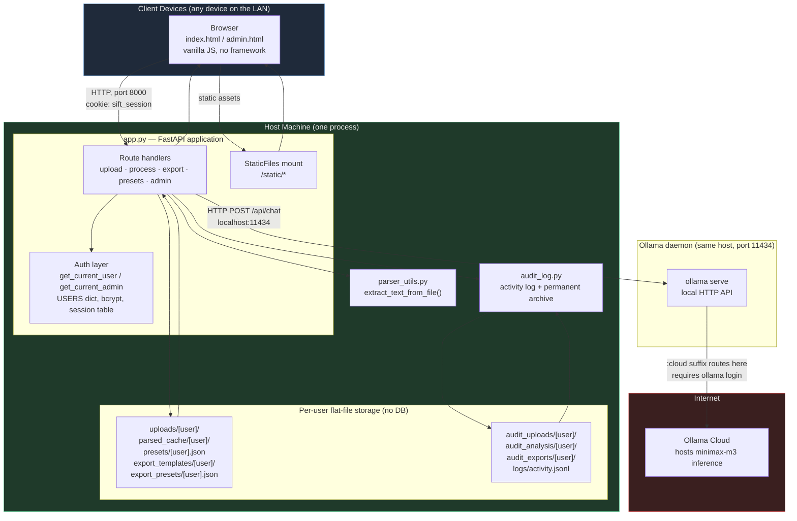
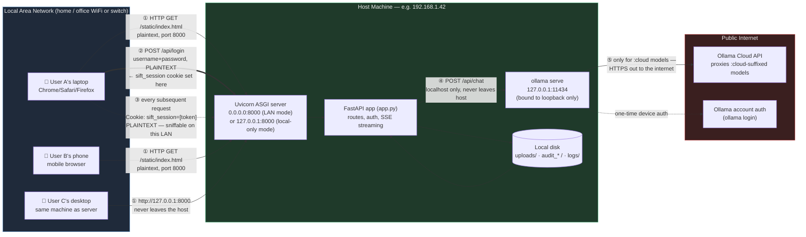
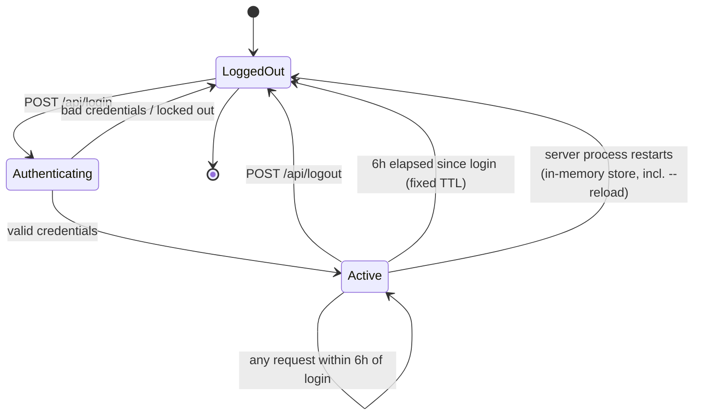
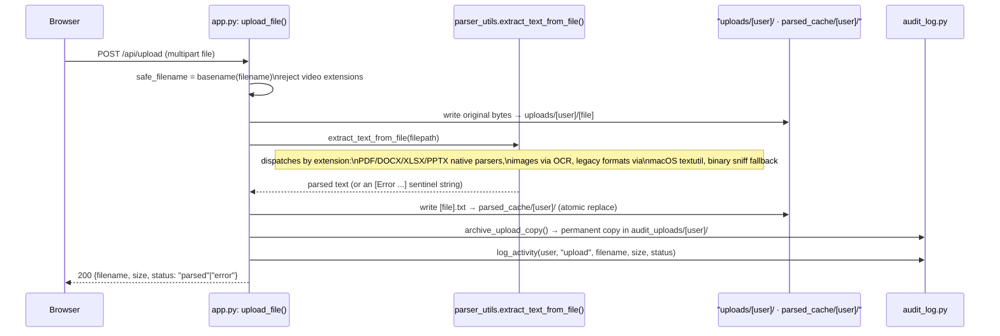
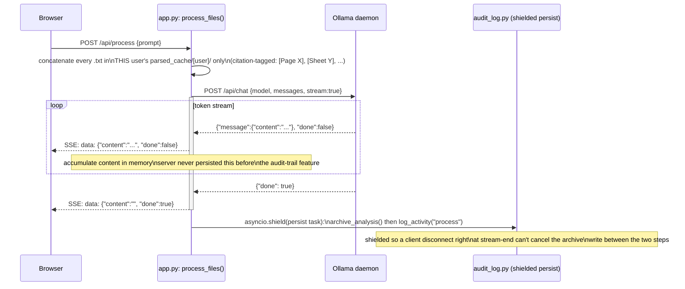
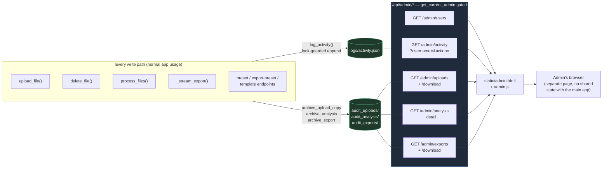
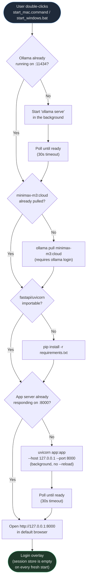

# Sift — Technical Documentation

**Version reference:** post audit-trail/admin-panel feature (2026-07-15)
**Stack:** FastAPI + Uvicorn (Python 3.13+), vanilla JS frontend, local Ollama daemon proxying to `minimax-m3:cloud`
**Deployment model:** single-process, single-host, LAN-shared, no database, no cloud hosting

---

## 1. What this system is

Sift is a single-screen document analysis dashboard. A small, fixed set of hardcoded
accounts log in, upload documents (PDF/DOCX/XLSX/PPTX/images/text/RTF/ODT), get them
parsed to text server-side, run AI-assisted analysis queries against a local Ollama
instance, and export the results as Markdown/Excel/PDF/Word. Every account's data is
filesystem-isolated from every other account's. An `is_admin`-flagged account can see a
permanent, append-only audit trail of everyone's activity through a separate admin panel.

It runs as one Python process on one machine (the "host"), reachable either only from
that machine (`127.0.0.1`) or from every device on the local network (`0.0.0.0`),
depending on how it's started. There is no cloud backend, no container orchestration, no
database server — persistence is flat files on the host's own disk.

---

## 2. Quick facts

| | |
|---|---|
| Web framework | FastAPI ≥0.115, served by Uvicorn ≥0.30 |
| Frontend | Vanilla JS, no build step, no bundler, no framework |
| Model | `minimax-m3:cloud` via a **local** Ollama daemon (`http://localhost:11434`) |
| Auth | Hardcoded `USERS` dict in `app.py`, bcrypt hashes, opaque session tokens |
| Session store | In-memory Python dict — wiped on every process restart |
| Session TTL | 6 hours, fixed from login time (not sliding) |
| Transport security | **None.** Plain HTTP only, no TLS anywhere in this stack |
| Persistence | Flat files under the project directory — no SQL/NoSQL database |
| Default bind | `127.0.0.1:8000` (localhost-only) via the launcher scripts |
| LAN-shared bind | `0.0.0.0:8000` (opt-in, manual dev-server flag) |
| Multi-tenancy | Filesystem-namespaced per username — structural, not permission-checked |

---

## 3. Component architecture



**Reading this diagram:** everything inside "Host Machine" is one OS process — there's
no internal network hop between the web layer, the parser, the audit log, and the
filesystem; those are plain Python function calls. The only two real network hops are
Browser↔Server (LAN, plaintext HTTP) and Server↔Ollama (localhost, then out to the
internet only for the `:cloud` model's actual inference).

---

## 4. Network flow graph

This is the actual traffic map: who talks to whom, over what protocol, on what port,
and — critically — where encryption does and doesn't exist.



### What this diagram is telling you

| Hop | Protocol | Encrypted? | Notes |
|---|---|---|---|
| ① Browser → Uvicorn (page load) | HTTP | **No** | No TLS anywhere in this stack. See §9. |
| ② Browser → Uvicorn (`/api/login`) | HTTP | **No** | Username + password travel in cleartext on the LAN. |
| ③ Browser → Uvicorn (every other request) | HTTP | **No** | `sift_session` cookie is `HttpOnly` + `SameSite=Lax`, but not TLS-protected — anyone else on an untrusted network segment can read it off the wire and hijack the session for its 6-hour life. |
| ④ FastAPI → Ollama daemon | HTTP | N/A (loopback) | Never leaves the host — `localhost:11434` is not reachable from the LAN. |
| ⑤ Ollama daemon → Ollama Cloud | HTTPS | Yes | Only for the `:cloud`-suffixed model; this is Ollama's own daemon making an outbound call, not anything Sift constructs directly. |

**The one deliberate security boundary that exists:** `CORSMiddleware` is configured
with `allow_origins=["*"]` but **no** `allow_credentials=True`. That combination is
intentional — a wildcard origin *with* credentials would let any other site read a
logged-in user's session cookie cross-origin; without credentials, the wildcard is inert
for anything cookie-authenticated. See `CLAUDE.md`'s CORS gotcha for the full reasoning.

**What's reachable without logging in at all:** FastAPI auto-generates `/docs`
(Swagger UI), `/redoc`, and `/openapi.json` — none of these have `get_current_user` as a
dependency, because they're framework-level routes, not ones defined in `app.py`.
Anyone who can reach port 8000 can browse the full API shape (every route, every
parameter name) without a session. No data is exposed through them (they describe the
API, they don't call it), but it is genuine unauthenticated surface worth knowing about.

---

## 5. Authentication & session lifecycle

```mermaid
sequenceDiagram
    participant B as Browser
    participant S as FastAPI (app.py)
    participant Sessions as In-memory _sessions dict

    B->>S: POST /api/login {username, password}
    alt username locked out (5 failures)
        S-->>B: 429 "Too many failed attempts, retry in Ns"
    else unknown username
        Note over S: bcrypt.checkpw() still runs against\na DUMMY hash — timing reveals nothing
        S-->>B: 401 Invalid username or password
    else wrong password
        S->>S: record failure, lock after 5th
        S-->>B: 401 Invalid username or password
    else correct credentials
        S->>Sessions: token = secrets.token_urlsafe(32)\nstore {username, expires_at: now+6h}
        S-->>B: 200 {username, is_admin}\nSet-Cookie: sift_session=[token]\nHttpOnly; SameSite=Lax; Max-Age=21600
        S->>S: audit_log.log_activity(username, "login")
    end

    loop every subsequent request
        B->>S: any /api/* request\nCookie: sift_session=[token]
        S->>Sessions: look up token
        alt expired or unknown
            Sessions-->>S: not found / expired
            S-->>B: 401 Session expired or invalid
            Note over B: apiFetch() wrapper centrally\nre-shows the login overlay
        else valid
            Sessions-->>S: username
            S->>S: handle request as that user
        end
    end

    B->>S: POST /api/logout
    S->>Sessions: delete token (no auth required for this call)
    S-->>B: 200, Set-Cookie deleted
    S->>S: audit_log.log_activity(username, "logout")
```



The session TTL is **fixed from login time**, not sliding — a user active at hour 5:59
is still logged out at hour 6:00. The in-memory store means the *entire team* gets
logged out simultaneously any time the process restarts, including a `uvicorn --reload`
triggered by editing any watched file during development.

---

## 6. Per-user data isolation

Every account's data lives under its own subdirectory (or its own named file), never a
shared pool. `username` is only ever a value that has already come out of
`get_current_user()` — a validated `USERS` key — so joining it directly into a
filesystem path carries no traversal risk.

```mermaid
graph TB
    Root["Project root"]
    Root --> UP["uploads/"]
    Root --> CA["parsed_cache/"]
    Root --> PR["presets/"]
    Root --> ET["export_templates/"]
    Root --> EP["export_presets/"]
    Root --> AU["audit_uploads/"]
    Root --> AA["audit_analysis/"]
    Root --> AE["audit_exports/"]
    Root --> LG["logs/"]

    UP --> UPa["admin/*.pdf, *.xlsx, ..."]
    UP --> UPb["alice/*.pdf, ..."]
    CA --> CAa["admin/*.txt (parsed)"]
    CA --> CAb["alice/*.txt (parsed)"]
    PR --> PRa["admin.json"]
    PR --> PRb["alice.json"]
    ET --> ETa["admin/&lt;uuid&gt;.xlsx"]
    EP --> EPa["admin.json"]
    AU --> AUa["admin/&lt;record_id&gt;__file.pdf<br/>+ &lt;record_id&gt;.meta.json"]
    AA --> AAa["admin/&lt;record_id&gt;.md<br/>+ &lt;record_id&gt;.meta.json"]
    AE --> AEa["admin/&lt;record_id&gt;__report.xlsx<br/>+ &lt;record_id&gt;.meta.json"]
    LG --> LGa["activity.jsonl<br/>(single shared file, every user's<br/>events interleaved by timestamp)"]

    style UPa fill:#1f3a2a,stroke:#5ac48f,color:#eee
    style CAa fill:#1f3a2a,stroke:#5ac48f,color:#eee
    style PRa fill:#1f3a2a,stroke:#5ac48f,color:#eee
    style ETa fill:#1f3a2a,stroke:#5ac48f,color:#eee
    style EPa fill:#1f3a2a,stroke:#5ac48f,color:#eee
    style AUa fill:#1f3a2a,stroke:#5ac48f,color:#eee
    style AAa fill:#1f3a2a,stroke:#5ac48f,color:#eee
    style AEa fill:#1f3a2a,stroke:#5ac48f,color:#eee
```



Two independent isolation mechanisms are stacked here:

1. **Live workspace** (`uploads/`, `parsed_cache/`, `presets/`, `export_templates/`,
   `export_presets/`) — reflects exactly what a user currently sees in their own UI.
   Deleting a file removes it from here.
2. **Permanent archive** (`audit_uploads/`, `audit_analysis/`, `audit_exports/`) —
   written once, at the moment content is created (upload time / generation time), never
   modified by later user actions. `logs/activity.jsonl` is the one genuinely *shared*
   file in the whole system — by design, since it's the admin's cross-user activity feed
   — but it's write-only from each request's perspective (append under a lock) and
   read-only from the admin panel's, so it's not a concurrency or isolation risk.

---

## 7. Request flow: file upload



The permanent archive copy is made **at upload time**, independent of whatever happens
next — so even a delete two seconds later can't lose it.

---

## 8. Request flow: analysis query (SSE)



**Why the shield matters:** without it, a client that disconnects at the very end of the
stream can cancel the request task mid-way through the two-step archive-then-log
sequence, leaving an archived `.md` file on disk with no corresponding activity-log
entry — an inconsistent audit trail. This was found live during verification and fixed
by wrapping the persist step in `asyncio.shield()`.

---

## 9. Request flow: document export (two pipelines)

```mermaid
flowchart TD
    Start(["POST /api/export-excel<br/>/api/export-pdf<br/>/api/export-word"]) --> HasTemplate{"template_filename<br/>provided?"}

    HasTemplate -- No --> ScriptPipeline
    HasTemplate -- Yes --> SchemaCheck{"format is xlsx/docx,<br/>or PDF with real<br/>AcroForm fields?"}

    SchemaCheck -- No --"fixed-layout PDF<br/>template, nothing<br/>discrete to map onto"--> ScriptPipeline
    SchemaCheck -- Yes --> ClonePipeline

    subgraph ScriptPipeline["Script pipeline"]
        direction TB
        SP1["Model writes a whole<br/>Python script tailored<br/>to this specific report"]
        SP2["AST allowlist validation<br/>(_validate_generated_code)"]
        SP3["Run in subprocess:<br/>CPU-rlimit + wall-clock timeout"]
        SP4{"Script succeeded?"}
        SP5["Deterministic fallback<br/>(_generate_*_bytes)"]
        SP1 --> SP2 --> SP3 --> SP4
        SP4 -- No, twice --> SP5
    end

    subgraph ClonePipeline["Clone pipeline"]
        direction TB
        CP1["Extract template's real<br/>structure: cells / paragraphs /<br/>form fields, tagged [ID=...]"]
        CP2["Model returns ONLY a JSON<br/>field-mapping {id: value}<br/>— no code generation"]
        CP3["Trusted, backend-authored<br/>splice function applies the<br/>mapping to a template copy"]
        CP1 --> CP2 --> CP3
    end

    SP4 -- Yes --> FileBytes
    SP5 --> FileBytes
    CP3 --> FileBytes["file_bytes ready in memory"]

    FileBytes --> Archive["audit_log.archive_export()<br/>shielded persist task<br/>→ audit_exports/[user]/"]
    Archive --> SSE["Terminal SSE event:<br/>base64 file + filename + mime type"]
    SSE --> Done(["Browser decodes + downloads"])

    style ScriptPipeline fill:#2a1f3a,stroke:#8f5ac4,color:#eee
    style ClonePipeline fill:#1f3a2a,stroke:#5ac48f,color:#eee
```

The clone pipeline is the meaningfully smaller attack surface: the model never writes or
runs code, it only returns a bounded JSON object that a trusted function applies. The
script pipeline **does** run LLM-generated Python on the host — guarded by an AST
import/name allowlist and a subprocess CPU/wall-clock limit, but that's defense-in-depth,
not a real sandbox (no seccomp, no chroot, no network namespace). Acceptable for a
local/LAN single-trust-boundary tool; not something to port to a multi-tenant or
externally-reachable deployment without real sandboxing first.

Both pipelines stream real per-stage progress over the same SSE channel, and both
archive the final bytes permanently before the file ever reaches the browser.

---

## 10. Audit trail & admin panel data flow



Key property: **deleting a file from the live workspace never touches the archive.**
`delete_file()` only removes from `uploads/<user>/` and `parsed_cache/<user>/` — the
archive copy made at upload time is untouched and remains admin-visible/downloadable
indefinitely. There is currently no retention or pruning policy on the archive — it only
ever grows, a deliberate tradeoff of "never lose an actual artifact" over disk
efficiency for a small team.

`still_live` (shown in the admin uploads browser) is computed per-record, not per-file:
only the *newest* archived record for a given `(user, filename)` pair can ever be
flagged live, so an older revision superseded by a later upload of the same filename
correctly shows as no-longer-live even though a file with that name exists again.

---

## 11. Startup / deployment flow



Both launcher scripts are idempotent — re-running one after everything's already up just
detects that and opens the browser. Neither script binds to `0.0.0.0`; LAN sharing is a
manual choice made by starting the dev server directly with `--host 0.0.0.0`.

---

## 12. Full API surface

| Method | Path | Auth | Purpose |
|---|---|---|---|
| `GET` | `/` | — | Redirects to `/static/index.html` |
| `POST` | `/api/login` | — | Credential check, brute-force lockout, sets session cookie |
| `POST` | `/api/logout` | — (self-contained) | Clears session server-side + cookie |
| `GET` | `/api/me` | ✓ | `{username, is_admin}` — drives frontend's `checkAuth()` |
| `POST` | `/api/upload` | ✓ | Save + parse + cache + archive a file |
| `GET` | `/api/files` | ✓ | List current user's live files |
| `DELETE` | `/api/files/{filename}` | ✓ | Remove from live workspace only |
| `GET`/`POST`/`DELETE` | `/api/presets[/{name}]` | ✓ | Analysis-query prompt presets |
| `POST` | `/api/enhance-prompt` | ✓ | AI-rewrite a raw analysis prompt |
| `POST` | `/api/process` | ✓ | SSE-streamed analysis over the user's own documents |
| `GET`/`POST`/`DELETE` | `/api/export-presets[/{name}]` | ✓ | Export-instructions presets (separate system) |
| `POST` | `/api/export-templates` | ✓ | Upload an .xlsx/.docx/.pdf template |
| `POST` | `/api/enhance-instructions` | ✓ | AI-rewrite export styling instructions |
| `POST` | `/api/export-excel` \| `-pdf` \| `-word` | ✓ | SSE-streamed export (script or clone pipeline) |
| `GET` | `/api/admin/users` | ✓ + admin | List configured accounts + roles |
| `GET` | `/api/admin/activity` | ✓ + admin | Filterable activity feed |
| `GET` | `/api/admin/uploads[/{u}/{id}/download]` | ✓ + admin | Archived uploads, list + download |
| `GET` | `/api/admin/analysis[/{u}/{id}]` | ✓ + admin | Archived analysis runs, list + full detail |
| `GET` | `/api/admin/exports[/{u}/{id}/download]` | ✓ + admin | Archived exports, list + download |
| `GET` | `/docs`, `/redoc`, `/openapi.json` | **none** | FastAPI auto-generated, not gated (see §4) |

---

## 13. Security posture summary

| Concern | Status | Detail |
|---|---|---|
| Password storage | ✅ Good | bcrypt hashes only, never plaintext, never in transit-comparison timing leaks |
| Brute-force protection | ✅ Basic | 5 failures → 60s per-username lockout |
| Session token | ✅ Good | `secrets.token_urlsafe(32)`, `HttpOnly`, `SameSite=Lax` |
| Cross-account data isolation | ✅ Structural | Filesystem-namespaced by username, not permission-checked after the fact |
| Transport encryption | ❌ None | Plain HTTP; credentials and session cookie are sniffable on the LAN |
| CORS | ✅ Hardened | Wildcard origin, but no `allow_credentials` — cookie can't be ridden cross-origin |
| Admin authorization | ✅ Explicit | `get_current_admin` 403s non-flagged accounts on every `/api/admin/*` route |
| Path traversal (uploads/templates/records) | ✅ Guarded | `os.path.basename()`, explicit `_is_template_filename_valid`, `_RECORD_ID_RE` regex validation |
| LLM-generated code execution | ⚠️ Defense-in-depth only | AST allowlist + subprocess rlimits, not a real sandbox — acceptable at this trust boundary only |
| Unauthenticated API discovery | ⚠️ Minor | `/docs`/`/redoc`/`/openapi.json` are reachable without login (framework default) |
| Audit trail integrity | ✅ Verified | `asyncio.shield()` on archive+log writes survives client mid-stream disconnects |
| Data retention | ℹ️ By design | Archive and activity log grow forever — no pruning policy exists yet |

**Bottom line:** this is correctly scoped as a trusted-LAN, known-small-team tool, not a
public-facing service — every control here matches that threat model. The single
biggest thing that would change if it were ever exposed beyond a trusted LAN is
transport security: put a reverse proxy with a real TLS certificate in front of it
before doing that, since nothing inside the app itself provides encryption.

---

## 14. Module map

| File | Responsibility |
|---|---|
| `app.py` | FastAPI app: every route, auth, session store, per-user path helpers, export pipeline orchestration |
| `parser_utils.py` | `extract_text_from_file()` — the entire document→text conversion surface |
| `audit_log.py` | Activity log (JSONL) + permanent per-user archive (uploads/analysis/exports) |
| `static/index.html` / `style.css` / `script.js` | Main dashboard UI, login overlay, all fetch logic |
| `static/admin.html` / `admin.js` | Admin panel — standalone page, own auth check, no shared JS state |
| `start_mac.command` / `start_windows.bat` | Idempotent double-click launchers |
| `test_backend.py` | Offline-ish smoke test: Ollama ping + parser round-trip |
| `verify_integration.py` | Live end-to-end test against a running server, incl. cross-account and admin-panel checks |
